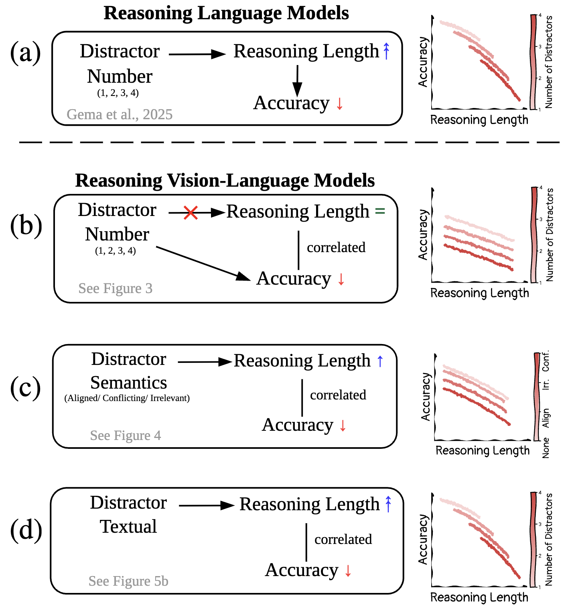
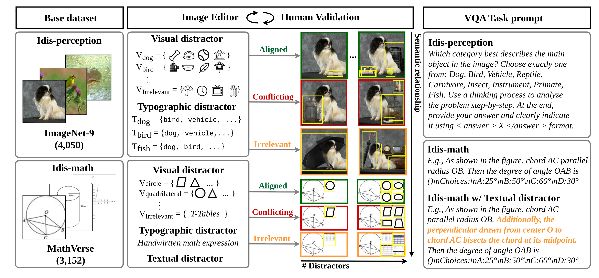

# Understanding the Effects of Distractors on Reasoning Vision-Language Models

**Pohang University of Science and Technology (POSTECH)**

The 2026 Conference on Empirical Methods in Natural Language Processing (EMNLP 2026)

Jiyun Bae, Hyunjong Ok, [Sangwoo Mo](https://sites.google.com/view/sangwoomo/publications?authuser=0), [Jaeho Lee](https://jaeho-lee.github.io/)

[[Paper](https://arxiv.org/abs/2511.21397)] | [[Dataset](#data-preparation)]

<p align="center">
  
</p>

**TL;DR**: Textual distractors are known to intensify inverse scaling in reasoning LMs: models reason longer and get worse. We introduce **Idis** (Images with distractors), a VQA benchmark suite that varies distractor *modality*, *number*, and *semantic relationship* (aligned / conflicting / irrelevant) over perception-centric (ImageNet-9) and reasoning-centric (MathVerse) tasks. Visual distractors behave differently from textual ones: they lower accuracy **without** lengthening the reasoning trace, shifting the whole length–accuracy curve downward, while textual distractors in the prompt reproduce the LM-style inverse scaling. The fraction of distractor-related attributes verbalized in the trace, not its length, predicts the failure, and a simple attribute-guiding prompt reduces it.

## Citation

If you find our work or dataset useful, please consider giving a star ⭐ and citing:

```bibtex
@inproceedings{bae2026idis,
  title     = {Understanding the Effects of Distractors on Reasoning Vision-Language Models},
  author    = {Bae, Jiyun and Ok, Hyunjong and Mo, Sangwoo and Lee, Jaeho},
  booktitle = {Proceedings of the 2026 Conference on Empirical Methods in Natural Language Processing (EMNLP)},
  year      = {2026}
}
```

## Installation

We develop this codebase on Python 3.11, PyTorch 2.10 and vLLM 0.19 with CUDA 12.8.

```bash
conda create -n idis python=3.11 -y
conda activate idis
pip install -r requirements.txt
```

The DeepSeek-based attribute extractors (`analysis/attribute_extraction/`) need `DEEPSEEK_API_KEY`.
The object-area analysis needs [LangSAM](https://github.com/luca-medeiros/lang-segment-anything).

## Data Preparation



### Idis-perception

Built on the *original* split of [ImageNet-9](https://github.com/MadryLab/backgrounds_challenge) (4,050 images, 9 classes).
Distractors are inserted with Gemini 2.5 Flash Image and validated by human annotators;
typographic distractors render non-target class names into the image.
Download link: coming soon.

<pre>
idis_perception/
├── original/&lt;class&gt;/&lt;stem&gt;.JPEG                        # no-distractor baseline
├── &lt;class&gt;/&lt;n&gt;/{aligned,conflicting,irrelevant}/&lt;stem&gt;.png   # n = 1..4 visual distractors
└── meta/&lt;class&gt;-&lt;n&gt;-&lt;semantic&gt;.jsonl                    # question files for run_perception.py
</pre>

### Idis-math

Built on the *testmini* split of [MathVerse](https://huggingface.co/datasets/AI4Math/MathVerse).
Set `MATHVERSE_ROOT` to a directory holding `testmini.json` and `testmini/images/`.
Irrelevant distractors are drawn from the table subset of [LogicVista](https://github.com/Yijia-Xiao/LogicVista) (`LOGICVISTA_ROOT`).

Either download the pre-built images (link: coming soon) or rebuild them:

```bash
export MATHVERSE_ROOT=/path/to/MathVerse LOGICVISTA_ROOT=/path/to/LogicVista_export
python idis_math/build/gen_visual_distractors.py --mode both      # aligned + conflicting
python idis_math/build/gen_irrelevant_distractors.py               # irrelevant (LogicVista tables)
python idis_math/build/gen_textual_distractors.py --num-distractors 4   # textual (Sonnet 4.5 via `claude` CLI)
```

<pre>
$MATHVERSE_ROOT/
├── testmini.json
├── testmini/images/
└── mathverse_aug/
    ├── library/{aligned,conflicting,irrelevant}/n{1..4}/...   (+ meta.jsonl per variant)
    └── text_distractor/n{1..4}/meta.jsonl
</pre>

### Waterbirds

Used for the prompt-strategy experiment (Sec. 6.3). Download from the
[official release](https://github.com/kohpangwei/group_DRO) and prepare a question JSONL with
`{"question_id", "image", "label", "background"}` per row.

## Evaluation

Four open-weight reasoning VLMs are supported (`inference/models.py`):
`Qwen/Qwen3-VL-8B-Thinking`, `zai-org/GLM-4.1V-9B-Thinking`, `internlm/Intern-S1-mini`, `Fancy-MLLM/R1-Onevision-7B-RL`.

**Idis-perception / Waterbirds** — 5 samples per image (T = 0.7, top-p = 0.95), then scoring with each model's tokenizer for reasoning length:

```bash
python inference/run_perception.py --dataset Background_Challenge --prompt base \
    --model-path Qwen/Qwen3-VL-8B-Thinking --image-folder /path/to/idis_perception \
    --question-file meta/bird-4-conflicting.jsonl \
    --answers-file results/qwen3-thinking/qwen3-thinking-bird-4-conflicting.jsonl
python inference/score_perception.py --root results --out perception.xlsx

# attribute-guiding prompt (Sec. 6.3)
python inference/run_perception.py --dataset Background_Challenge --prompt strategy --greedy ...
python inference/run_perception.py --dataset waterbirds --prompt strategy --greedy ...
python inference/score_waterbirds.py --root results_waterbirds --out waterbirds.xlsx
```

**Idis-math** — vLLM batch inference, then a Qwen3.5-27B judge following the VLMEvalKit MathVerse protocol:

```bash
python inference/run_math_vllm.py --model-path Qwen/Qwen3-VL-8B-Thinking \
    --tasks "original:1,aligned:1,aligned:4,conflicting:4,irrelevant:4,text_distractor:4" \
    --num-samples 5 --temperature 0.7 --output-dir results_math/qwen3-thinking
python inference/judge_math.py --results-files results_math/qwen3-thinking/*.jsonl
```

## Analysis

```bash
# attribute extraction from reasoning traces (Tables 6–8)
export DEEPSEEK_API_KEY=...
python analysis/attribute_extraction/extract_perception.py \
    --input results/qwen3-thinking/qwen3-thinking-bird-4-conflicting_s0.jsonl \
    --out_prefix attrs/qwen3-thinking-bird-4-conflicting --loop
python analysis/attribute_extraction/extract_math.py --input sentences/ --out_dir attrs_math/
python analysis/attribute_extraction/extract_waterbirds.py --input results_waterbirds/qwen3-thinking/part_01_s0.jsonl \
    --output attrs_waterbirds/qwen3-thinking-part_01.jsonl

# target / distractor pixel area with LangSAM (distractor area ratio)
python analysis/object_area/langsam_area.py --jsonl objects.jsonl --out-base area/

# attention blocking (Fig. 7a)
python analysis/attention_blocking/build_inputs.py --model qwen3-thinking \
    --parser-root attrs_sentence/ --traces-root results/ --output abf/inputs_qwen3-thinking.parquet
python analysis/attention_blocking/run_block_force.py --inputs abf/inputs_qwen3-thinking.parquet \
    --class-group dog,bird,vehicle --out-jsonl abf/qwen3-thinking/dbv.jsonl
python analysis/attention_blocking/analyze.py --root abf
```

## License

This project is released under the [MIT License](LICENSE).
Datasets follow the licenses of their sources (ImageNet, MathVerse, LogicVista, Waterbirds).

## Acknowledgements

Our code builds on [MathVerse](https://github.com/ZrrSkywalker/MathVerse), [VLMEvalKit](https://github.com/open-compass/VLMEvalKit),
[LogicVista](https://github.com/Yijia-Xiao/LogicVista), [Backgrounds Challenge (ImageNet-9)](https://github.com/MadryLab/backgrounds_challenge),
[Waterbirds](https://github.com/kohpangwei/group_DRO), and [Language Segment-Anything](https://github.com/luca-medeiros/lang-segment-anything).
